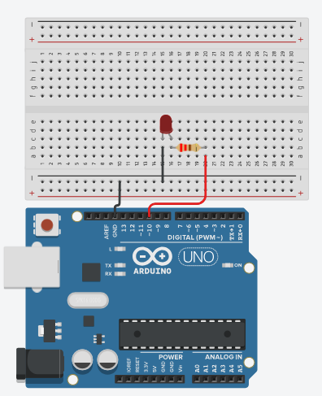

# 💡 Controle de LED com Python

Um projeto simples que permite **controlar o acendimento e apagamento de um LED** conectado ao **Arduino**, utilizando uma interface em **Python** via comunicação serial.

---

## 🚀 Objetivo

Entender como integrar **Python** e **Arduino** para controlar dispositivos eletrônicos, explorando o uso da biblioteca `pyserial` para comunicação entre o computador e o microcontrolador.

---

## 🧰 Materiais Utilizados

- **1 Arduino Uno**
- **1 LED**
- **1 Resistor de 220 Ω**
- **Cabos jumpers**
- **Protoboard**
- **Computador com Python instalado**

---

## ⚙️ Montagem do Circuito

Monte o circuito conforme o esquema abaixo:

| Pino Arduino | Componente                           | Descrição     |
| ------------ | ------------------------------------ | ------------- |
| 10           | Anodo do LED (via resistor de 220 Ω) | Saída digital |
| GND          | Catodo do LED                        | Terra         |




**Resumo:**  
O LED é ligado ao pino digital **10** através de um resistor de **220 Ω** e ao **GND** .

---

## ⚡ Como executar

1. Ter a biblioteca pyserial instalada em sua máquina
	Se não tiver pode instalar utilizando o comando ````
	 ```
	 pip install pyserial
	 ```
 2. Conecte seu Arduino na porta USB do computador
 3. Identifique a porta serial que o Arduino está ("COM3" para windows ou /dev/ttyACM0 para linux)
 4. Atualize a porta no código Python
 5. Execute o programa 
 6. Os comandos para acender ou apagar o led no terminal são:
	- L - Liga
	- D - Desliga
	- S - Sair do programa
